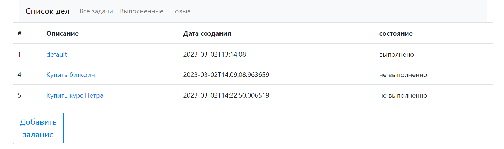
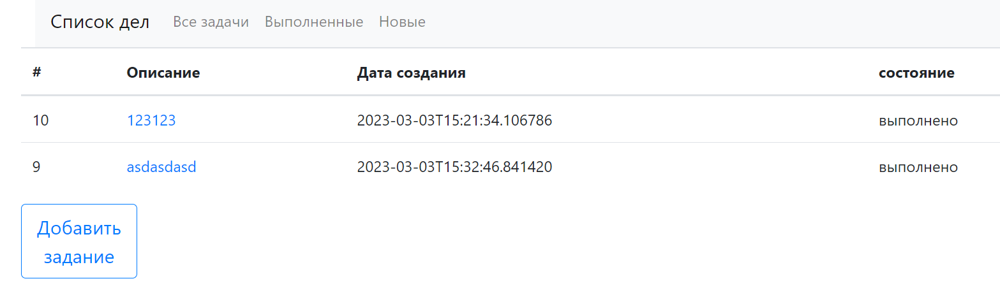
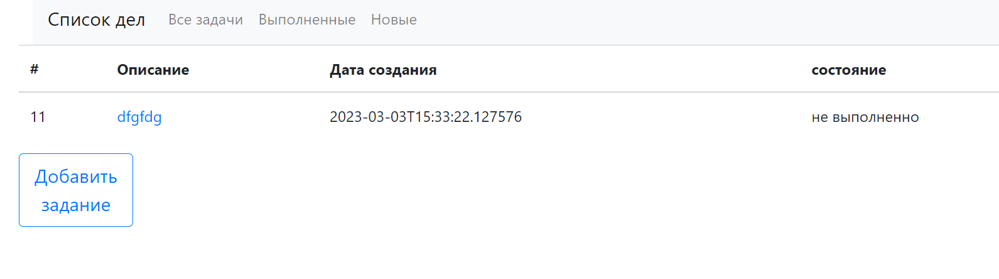
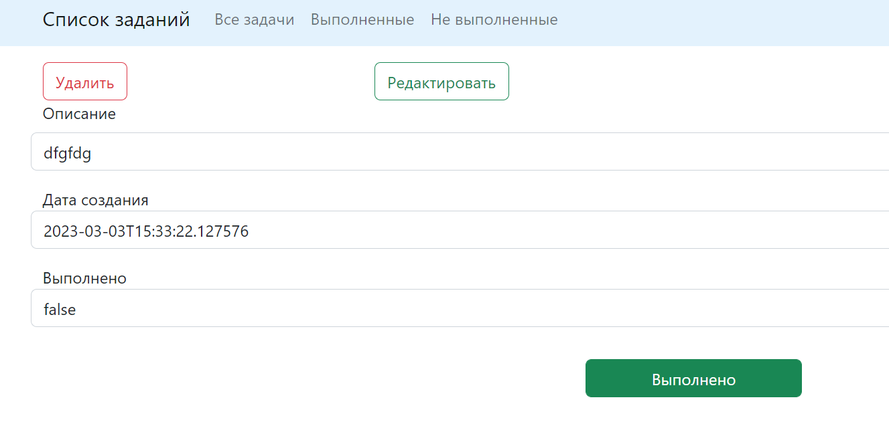
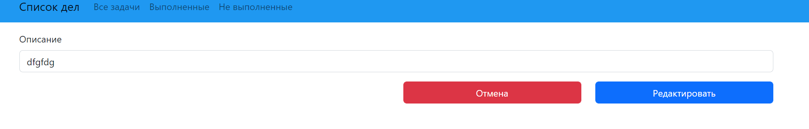
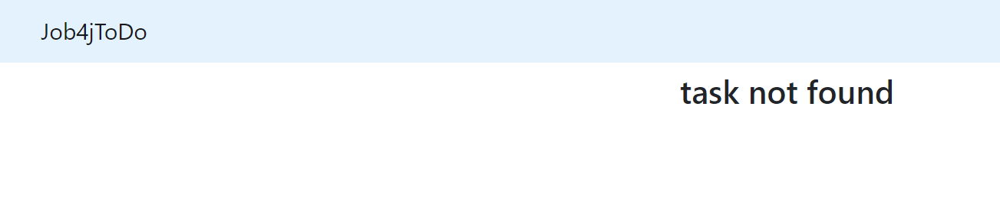

# Job4j_todo
## Проект "Список дел"

### Использованные технологии

1. Spring Framework
2. Thymeleaf
3. Bootstrap
4. Hibernate
5. PostgresSql 

### для сборки проекта понадобятся:
1. java 17
2. Maven 3.8.5
3. PostgresSQL 15

#### Запуск проекта:
1. Загрузите проект на свой компьютер.
2. В PostgresSQL создайте базу данных с названием ***tasks***.
3. В корневой папке проекта выполните команду
```shell
mvn install
```

4. Для запуска проекта используйе команду
 ```shell
java -jar target/job4j_todo-1.0.jar
```

5. В браузере перейдите по ссылке http://localhost:8080/

страница со списком дел:


можно добавить задание, описываем и нажимаем сохранить:


помотреть все выполненные:


посмотреть задания, которые необходимо выполнить:


выбираем задачу, можно отметить что задание выполненно


если нажмём на "Редактировать", попадаем в раздел редактирования описания


если задание с нужным ID небудет найдено, появится ошибка



## FEEDBACK
почта для обратной связи mmmarat86@gmail.com <br>
телега https://t.me/KhatipovMarat